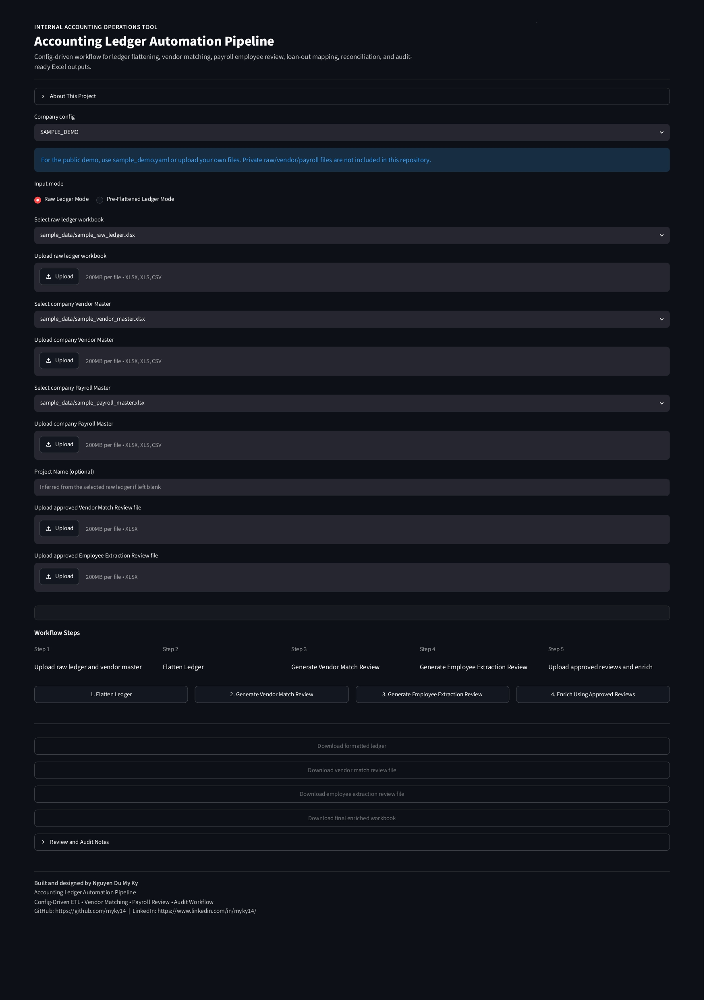
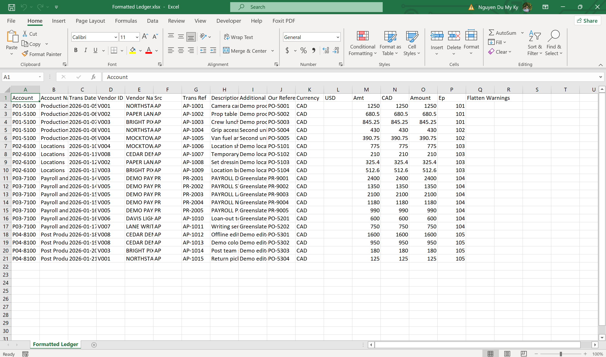
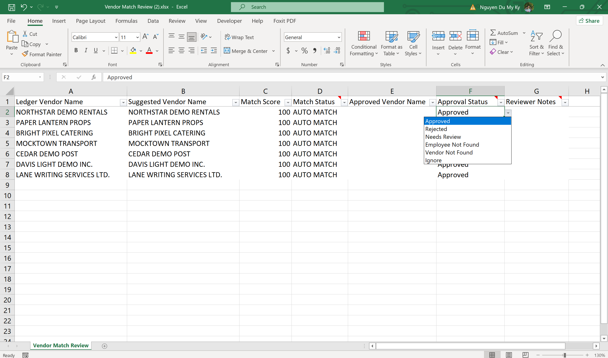
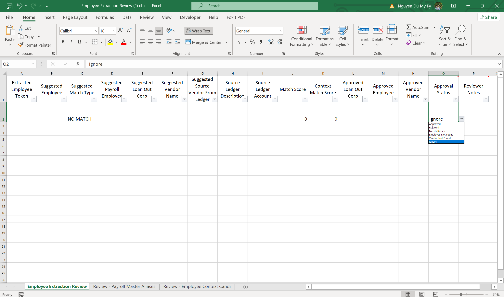
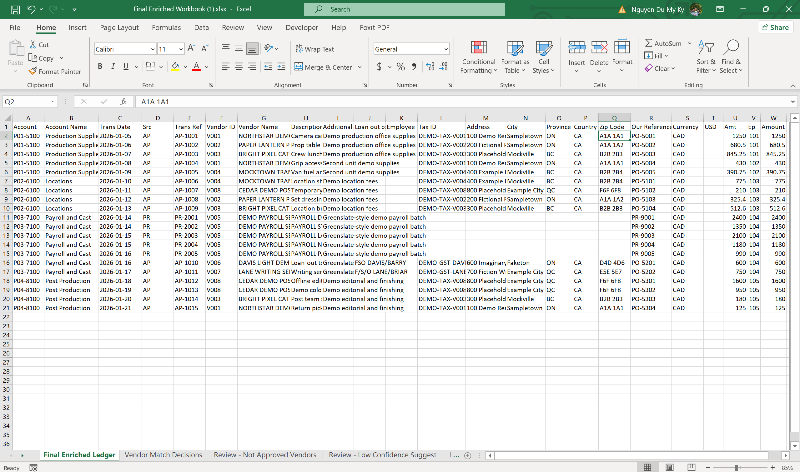

# Accounting Ledger Automation Pipeline


## Live Demo

🚀 Try the application here:

https://kynguyen-ledger-automation.streamlit.app/

A personal portfolio project that explores how Python can transform raw accounting ledger exports into structured, review-ready, audit-friendly datasets.

Created by **Nguyen Du My Ky**

---

## Why I Built This Project

I built this as a personal learning project to practice Python, data cleaning, automation, and workflow design through a realistic accounting workflow.

It was inspired by repetitive accounting-related tasks such as:

- Cleaning ledger exports
- Matching vendors
- Identifying payroll employees
- Looking up tax IDs and addresses
- Preparing review workbooks

The goal is to learn how automation can support real business workflows while still keeping human review and approval in control. 

Rather than building another tutorial project, I wanted to solve a real workflow problem and learn how automation can support day-to-day business operations.

---

## Project Overview

This project explores how Python can be used to automate repetitive accounting data preparation workflows. It simulates a practical internal workflow tool concept for ledger formatting, vendor matching, payroll review, and final workbook preparation.

Accounting and production finance teams often receive ledger exports in formats that are difficult to analyze directly. These files may contain account headers, nested descriptions, inconsistent vendor names, payroll processor rows, loan-out corporation references, and missing enrichment fields such as tax IDs or addresses.

The project emphasizes Human-in-the-Loop approval instead of blind automation. The workflow can prepare suggestions and review workbooks, but a person remains responsible for approving final enrichment decisions.

Target users include:

- Accounting teams
- Production accounting teams
- Finance operations teams
- Audit support teams
- Business and data analysts supporting accounting workflows

---

## Disclaimer

This is a personal portfolio project created for learning and demonstration purposes. It is not an official product of, endorsed by, or affiliated with any company.

Any sample data used in this repository should be fictional.

---

## Business Understanding

Typical workflow before automation:

```text
Raw Ledger
-> Excel cleanup
-> Vendor lookup
-> Payroll lookup
-> Tax ID lookup
-> Address lookup
-> Final workbook
```

Common problems:

- Repetitive manual formatting
- Human error during lookup and copy/paste work
- Inconsistent vendor and employee matching
- Limited audit trail for why a match was accepted
- Time-consuming review cycles across ledger, vendor, and payroll data

This prototype improves the workflow by turning manual cleanup and lookup steps into a structured pipeline. It prepares suggested matches, separates uncertain cases for review, and uses approved decisions to generate the final workbook.

---

## Data Understanding

### Raw Ledger

Hierarchical accounting ledger exports containing account sections, account names, transaction rows, additional descriptions, source references, currencies, and amounts.

### Vendor Master

A centralized vendor reference file containing vendor names, tax IDs, addresses, currency, and loan-out corporation aliases used for vendor enrichment.

### Payroll Master

A centralized employee reference file containing employee names, SIN fields, G/HST numbers, positions, addresses, and loan-out corporation information used for payroll matching.

No real client data should be included in the repository. Demo data, when present, must be fictional and safe for public portfolio use.

---

## Solution Architecture

```text
Raw Ledger
|
v
Flatten Ledger
|
v
Vendor Match Review
|
v
Employee Extraction Review
|
v
Approved Mapping
|
v
Final Enriched Workbook
```

### Step Summary

- **Flatten Ledger**: Converts hierarchical ledger exports into transaction-level rows.
- **Vendor Match Review**: Suggests vendor matches against the vendor master and prepares a review workbook.
- **Employee Extraction Review**: Extracts employee names from payroll descriptions and prepares payroll review records.
- **Approved Mapping**: Uses human-approved vendor and employee decisions as the source of truth.
- **Final Enriched Workbook**: Produces an audit-friendly workbook with enrichment fields, review sheets, reconciliation summaries, and run logs.

The current design uses a company-level configuration concept so multiple project ledgers can share the same vendor and payroll master structure.

---

## Key Features

### Ledger Flattening

Converts hierarchical production accounting exports into clean transaction-level data. The flattening logic preserves account context, account names, additional descriptions, transaction references, currencies, and amounts.

### Vendor Matching

Matches ledger vendor names against a centralized vendor master using exact, normalized, fuzzy, and alias-aware matching. Suggested matches are written to a review workbook instead of being blindly applied.

### Payroll Employee Matching

Identifies payroll-related ledger rows and extracts employee names from payroll descriptions. Matches are compared against payroll master records for employee-level enrichment.

### Loan-Out Corporation Support

Supports production accounting scenarios where employees may be paid through loan-out corporations. The workflow can distinguish between individual employee records, payroll processors, vendor entities, and loan-out corporations.

### Employee Context Matching

When a direct employee match is not obvious, the workflow can use surrounding ledger context and related vendor information to suggest likely matches for review.

### Approval Workflow

The project follows a Human-in-the-Loop workflow. It suggests matches, but approved review files determine what gets enriched in the final workbook.

### Reconciliation & Audit Controls

Generated outputs include reconciliation summaries, run logs, match statuses, approval statuses, review sheets, and exception sheets to support auditability.

---

## Technologies

- Python
- Pandas
- OpenPyXL
- RapidFuzz
- Streamlit
- YAML configurations

---

## Setup

Install dependencies:

```powershell
pip install -r requirements.txt
```

Run the Streamlit application:

```powershell
streamlit run app.py
```

Run the CLI workflow with the fictional demo config:

```powershell
python main.py --config configs/sample_demo.yaml
```

For a private/local workflow, the same pattern can be adapted with a company-level config such as `configs/company_config.yaml`.

---

## Approach

### Step 1: Flatten Ledger

Read the raw hierarchical ledger and convert it into structured transaction rows.

### Step 2: Vendor Matching

Compare ledger vendors against the vendor master and generate suggested vendor matches.

### Step 3: Employee Extraction

Identify payroll rows, extract employee tokens from descriptions, and compare them against payroll master records.

### Step 4: Manual Review

Reviewers inspect suggested matches, approve reliable matches, and leave uncertain cases for follow-up.

### Step 5: Approved Enrichment

Only approved vendor and employee decisions are used to enrich tax IDs, addresses, loan-out corporations, and related fields.

### Step 6: Final Workbook Generation

Create the final enriched workbook with review records, reconciliation checks, and run logs.

---

## Results

Implemented outcomes:

- Config-driven architecture implemented
- Company-level configuration approach implemented
- Ledger flattening workflow implemented
- Vendor review workflow implemented
- Employee extraction review workflow implemented
- Loan-out corporation matching support implemented
- Human-in-the-Loop approval process implemented
- Streamlit UI implemented
- CLI workflow implemented
- Audit-friendly workbook outputs implemented
- Safe data handling and public-demo data practices applied

No artificial performance statistics are claimed. Results are based on implemented workflow capabilities.

---

## Screenshots

### Streamlit Home



### Formatted Ledger



### Vendor Match Review



### Employee Extraction Review



### Final Workbook


---

## Demo

### Live Demo
Streamlit Cloud Application
Public demo environment using fictional sample data
End-to-end workflow demonstration:
Ledger Flattening
Vendor Match Review
Employee Extraction Review
Approved Mapping
Final Workbook Generation

Live Application: https://kynguyen-ledger-automation.streamlit.app/
> Note: The public demo uses fictional sample data only.

### Local Usage
Streamlit Application
CLI Workflow
Sample Demo Dataset

### Planned Enhancements
Demo Video Walkthrough
Architecture Diagram
Portfolio Case Study

---

## Project Structure

```text
accounting-ledger-automation/
|-- app.py
|-- main.py
|-- config_loader.py
|-- ledger_flattener.py
|-- formatted_ledger.py
|-- vendor_matcher.py
|-- vendor_review.py
|-- employee_review.py
|-- utils.py
|-- requirements.txt
|-- README.md
|-- howtorun.md
|
|-- configs/
|   |-- company_config.yaml    # illustrative private/local config
|   `-- sample_demo.yaml
|
|-- docs/
|   |-- DATA_CONFIDENTIALITY.md
|   `-- cleanup_report.md
|
|-- tools/
|   `-- debug_payroll_extraction.py
|
|-- sample_data/
|   |-- sample_raw_ledger.xlsx
|   |-- sample_vendor_master.xlsx
|   `-- sample_payroll_master.xlsx
|
|-- Screenshots/
|
|-- archive/
|   `-- legacy/
|
|-- raw/
`-- output/
```

---

## Portfolio Highlights

This project demonstrates:

- Python automation
- Data cleaning and transformation
- Workflow design
- Human-in-the-loop approval systems
- Streamlit application development
- Accounting process improvement
- Config-driven architecture

---

## Status

Current Status: **Prototype Version 2.0**

### Completed

- Config-driven architecture
- Streamlit UI
- CLI workflow
- Ledger flattening
- Vendor Review Workflow
- Employee Review Workflow
- Loan-out corporation support
- Approved mapping workflow
- Reconciliation and audit support

### Planned

- Alias memory
- OCR invoice matching
- Audit dashboard
- Multi-company support
- Approval history database
- Deployment-ready demo environment

---

## Data Privacy

This repository is intended to contain code and fictional demo data only.

No real client data should be uploaded.

Real production data must never be committed, including:

- Client ledgers
- Vendor files
- Payroll files
- Employee personal information
- Tax IDs
- Addresses
- Audit workpapers

Recommended privacy controls:

- Keep `raw/` gitignored.
- Keep `output/` gitignored.
- Use only fictional sample data for public demos.
- Keep real ledgers, vendor files, payroll files, tax IDs, employee data, and addresses local and gitignored.
- Review files before committing to ensure no client data is included.

---

## Credits

Created by **Nguyen Du My Ky**

Business Information Systems Student

Focus areas:

- Accounting Process Automation
- Data Workflow Design
- Internal Business Tools

This project reflects my interest in accounting process automation, data workflow design, and practical Python tools for business operations.

Inspired by real-world production accounting workflows.

---

## Philosophy

Automate repetitive work.

Keep humans in control.

Prioritize auditability over blind automation.
